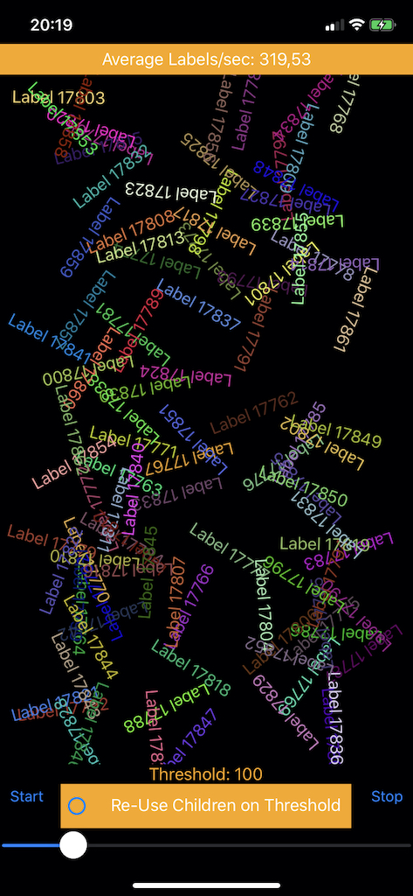

# SpeedViewTest

## Purpose

To establish the Labels per second that the respective Android and iOS implementations of Xamarin Forms can render.

## Screenshot

## Statistics

### Phone Model: iPhone XR

"With Child Re-Use" => Once Children Count Threshold is reached, re-use child elements
"Without Child Re-Use" => Once Children Count Threshold is reached, remove the first child, add another one at the end

#### Labels/Second

|Threshold|With Child Re-Use|Without Child Re-Use|
|---------|-----------------|--------------------|
|10       | 827 |684 |
|100      | 694 |319 |
|200      | 583 |137 |
|300      | 480 |65 |
|400      | 412 |45 |
|500      | 345 |38 |
|600      | 290 |21 |

## Findings

- Making changes to a large visual tree is costly in terms of througput per second, especially when the element count is above 100. 
- Updating existing elements in the visual tree has a less of an impact on performance.

